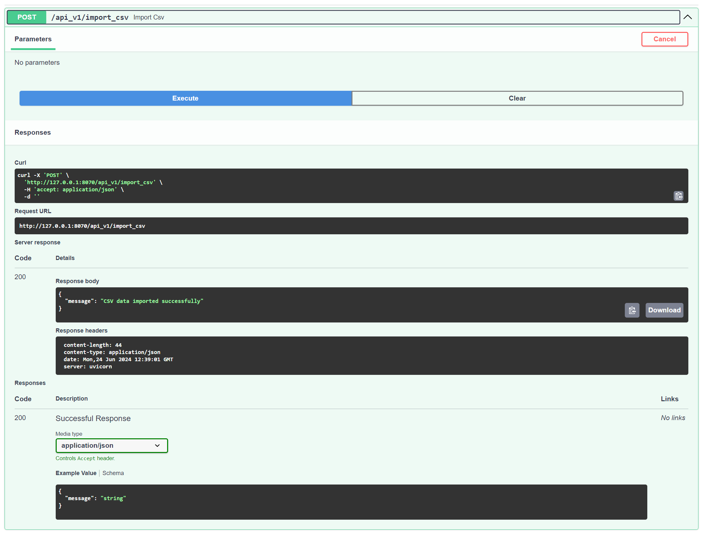

# levkivskyi-v-ajax-test-api


# Test Results API

This project provides an API to manage and retrieve statistics for tested devices in a production environment.

## Setup

1. Create a virtual environment and activate it:
   ```bash
   python3 -m venv venv
   source venv/bin/activate
   
2. Install requirements.txt
   ```bash
   pip install -r requirements.txt
   
3. Run Api
   ```bash
   uvicorn app.main:app --reload --port 8070
   
Api swagger: http://127.0.0.1:8070/docs

## API

#### Import CSV



#### Get Statistic

If you specify a request without parameters, we will get general statistics. Added filtering by operator, sensor type, test date


#### Create Test Result


#### Delete Test Result


